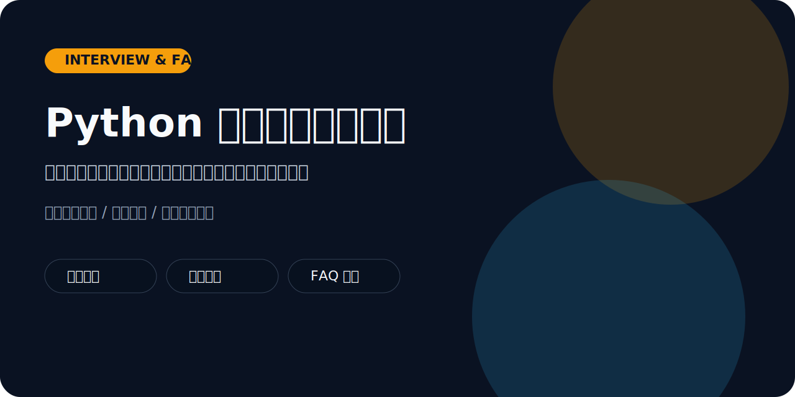

# Python 面试题与高频答疑




这个仓库定位不是“刷题库”，而是“带着理解去准备面试和学习难点”。它既适合做课堂热身，也适合用来做训练营答疑、转行复习和项目查漏补缺。

## 当前包含的内容

1. 命令行互动问答器
2. 多方向题库：基础、自动化、数据、采集、AI
3. 按目标方向生成的 4 周复习计划
4. 常见报错与学习问题 FAQ

## 这个仓库适合谁

- 想系统准备 Python 面试的人
- 想整理课堂高频问题的讲师
- 想边做项目边补基础的人
- 想把“答题能力”变成“讲题能力”的学习者

## 你可以怎么用它

- 做每日一题练习
- 做训练营开班前的基础摸底
- 做面试前 2 到 4 周的复习路径
- 做社群答疑资料库

## 效果预览

运行互动问答：

```bash
python quiz.py --tag ai --limit 2
```

终端会按“先提问、后展示答案”的形式输出。

运行复习计划生成：

```bash
python study_plan.py --target automation --weeks 4 --output plans/automation_plan.md
```

会生成类似：

```md
### Week 2
- 本周题目：Why is pathlib often preferred over manual string paths?
- 重点标签：automation
- 推荐讲法：先自己回答，再对照标准答案复盘。
```

## 仓库结构

- `data/questions.json`：题库
- `data/topic_paths.json`：不同方向的复习路径
- `quiz.py`：互动答题脚本
- `study_plan.py`：生成复习计划
- `faq/common_issues.md`：高频答疑
- `plans/`：生成后的学习计划

## 快速开始

```bash
python quiz.py --limit 3
python quiz.py --tag ai --limit 2
python study_plan.py --target automation --weeks 4 --output plans/automation_plan.md
```

## 推荐使用方式

- 如果你是求职者：每天跑 1 到 3 题，顺手把答案讲给自己听
- 如果你是讲师：把题库和项目仓库联动，形成“项目 + 面试”双线教学
- 如果你是助教：把 FAQ 文档当作值班答疑模板

## 为什么这个仓库值得 Star

- 题库不只给答案，还适合讲解思路
- 可以按方向做复习计划，更像训练营资料库
- 很适合和你的项目仓库联动使用
- 能帮助你在 GitHub 上建立“会教、会讲、会答疑”的讲师标签

## 常见扩展方向

- 增加不同难度分层题库
- 增加“项目常见追问”专题
- 增加面试模拟评分标准或答题模板

## 仓库维护

- 开源协议：`MIT`
- 更新记录见 `CHANGELOG.md`
- 贡献方式见 `CONTRIBUTING.md`
